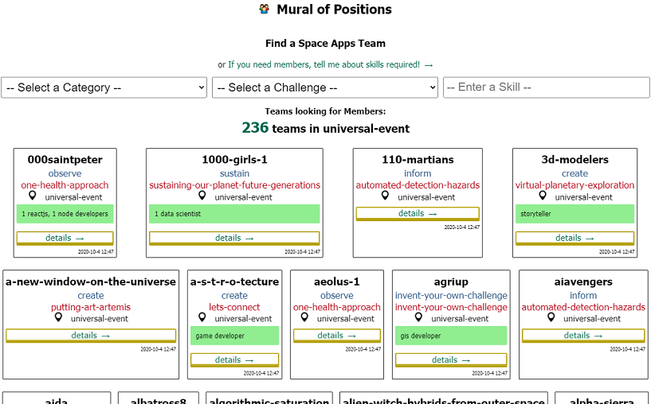

<!-- PROJECT LOGO -->
 

  

  <h3 align="center">Mural of Positions</h3>

  

    Find a NASA Space Apps Challenge Team over the Hackathon
     <strong>Explore the docs »</strong>
     
     
    <a href="https://spaceappsteammembers.web.app/">View Demo</a>
    ·
    <a href="https://github.com/alexbelloni/spaceappsteammembers/issues">Request Feature</a>
  

<!-- ABOUT THE PROJECT -->

## About The Project

The mural of position helped participants to find a Space Apps team and teams to choose new members over the hackathon on October 2020. It managers the available positions of a team like a job board.

### Mural built with

* Reactjs - frontend framework
* Firebase - database

### Importer built with

* Javascript
* node-html-parser
* puppeteer
* spa-crawler

<!-- USAGE EXAMPLES -->
## Steps of Usage

### Create a Firebase DB if aplicable  
The database is an array of objects with a structure:  
{  
  "location", //string  
  "lookingForMembers", //boolean    
  "positions", //array    
  "teamName", //string   
  "updated", //datetime   
  "url" //string   
  }  
### Export a backup of the DB if applicable  
This step is necessary because the addition of positions is executed after the crawling. This information is recovered from the backup to the new version of the database. The script compareBackup will do this task. 
### Run the script crawler  
I didn't have access to the official database of the hackathon. Therefore, the crawler reads the entire page (SPA) of the Universal Event teams. In case of a team has the badge "looking for members", it is selected and stored into a JSON file. 
 

    

  

  
    
### Run the script compareBackup    
This script reads the result of the previous step and injects the positions of each team.
### Import the new DB to the Firebase
Firebase receives the new database with teams looking members and current positions.   
### See the updates via the Mural page 
After that, the participant can see the updates
### Update Teams
The most common activity is to add new positions to a team. A member of a team informs the necessary skills. The mural has a method to send the new skills of a team to Firebase. 

<!-- CONTACT -->
## Contact

Alexandre Alves  
[LinkedIn](https://www.linkedin.com/in/alexandrealvestoca/)   
[Twitter](https://twitter.com/xbelloni) 

